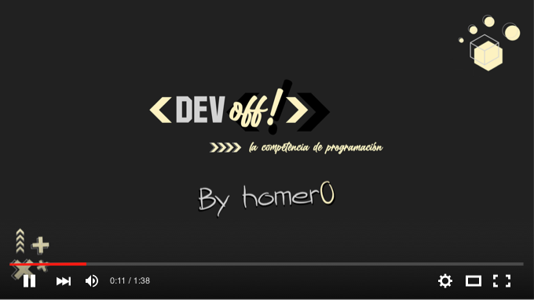

[](https://youtu.be/fmV-66De8wI)

📺 Video: [https://youtu.be/fmV-66De8wI](https://youtu.be/fmV-66De8wI)

🤘 Deploy: [https://devoffarg-03.homer0.dev](https://devoffarg-03.homer0.dev)

# Desafío 3 - 09/08/2020

Para este desafío, haremos uso de la API de Canvas en JavaScript y ¡crearemos una herramienta para dibujar en la Web!

Deberás implementar al menos dos de estas características:

- Selección de color
- Guardado de imagen
- Configuración del espesor del pincel
- Configuración del tamaño del lienzo
- Pincel con textura
- Goma de borrar

Algunos ejemplos:

- [HTML5 Canvas JavaScript drawing app with bucket tool](http://www.williammalone.com/projects/html5-canvas-javascript-drawing-app-with-bucket-tool/demo/drawing-app-with-bucket.html)
- [Sketch Pad](http://htmlpreview.github.io/?https://raw.githubusercontent.com/krisrak/html5-canvas-drawing-app/master/index.html) (presionar "New" al entrar)

## Condiciones del desafío

```
✅ Deberás utilizar un elemento `<canvas>`.
✅ Podrás usar librerías facilitadoras como jQuery.
⛔ No podrás agregar librerías externas relacionadas a Canvas.
⛔ Si usas jQuery, no podrás instalar plugins o complementos de jQuery.
```

## 📚 Herramientas de consulta

Podrás utilizar cualquier herramienta de búsqueda que necesites (amamos buscar en Google y leer Stack Overflow <3).

## ⏳ Tiempo

Tendrás **1 hora** para resolver el desafío.

## 🤔 ¿Cómo presento mi código?

### Si tenés una cuenta en GitHub

Hacé un fork de este repo:


Cloná tu fork, reemplazando `[TU_ALIAS]` con el nombre de tu cuenta de GitHub. Podés clonarlo utilizando la consola:

```
git clone https://github.com/[TU_ALIAS]/DevOff-Desafio-3
```

También podés utilizar GitHub Desktop, tu IDE favorito, lo que gustes.

Cuando finalices la resolución del desafío, no olvides subir todos tus cambios usando `git push` o el equivalente que ofrezca tu cliente de Git. Envianos por el chat de la transmisión o por DM a la cuenta de Twitter de DevOff Argentina el link a tu repositorio.

### Si no tenés una cuenta en GitHub

[Podés hacer clic aquí y mágicamente se descargará un archivo comprimido con todo lo que contiene este repositorio](https://github.com/devoffarg/DevOff-Desafio-3/archive/master.zip).

Cuando finalices la resolución del desafío, envianos un archivo ZIP con todo tu trabajo a través de [WeTransfer](https://wetransfer.com/) o una carpeta compartida en Google Drive.

## ⚖ Código de conducta

Participar de DevOff implica la aceptación de nuestro [Código de Conducta](https://github.com/devoffarg/codigo-de-conducta).

Ante cualquier consulta, podrás recurrir a nuestro [equipo de moderación](https://github.com/devoffarg/codigo-de-conducta#protocolo-de-moderaci%C3%B3n).

## 💜 Agradecimientos

### Jurados

- ¡Gracias a [Gonzalo Pozzo](https://twitter.com/goncy) y [Magalí Domínguez](https://twitter.com/printmaga) por ser nuestros jurados!
- ¡Un agradecimiento especial a [Johanna Santos](https://twitter.com/JohannaBleu), la jurado invitada de esta edición!

### Organizaciones aliadas

¡Gracias a [Migue Moyano](https://twitter.com/elmiguedev), [Joel A. Villarreal Bertoldi](https://twitter.com/joelalejandro) y [Agustín Carrasco](https://twitter.com/asermax) del equipo de [CoDeAr](https://twitter.com/somoscodear) por dar una mano para que este proyecto sea posible!

### Créditos

DevOff Argentina es un proyecto ideado por [Aldana Denise](https://twitter.com/gizmowis), con el apoyo de [CoDeAr](https://twitter.com/somoscodear).

## 🚀 Soluciones

¡A continuación, listamos todas las soluciones que se fueron presentando para este desafío!

🌟 Participantes EN VIVO:

- https://github.com/daianaszwimer/DevOff-Desafio-3, por Daiana Szwimer 🏆
- https://github.com/Gamzeescript/DevOff-Desafio-3, por Michelle Girón
- https://github.com/jenaro94/DevOff-Desafio-3, por Jenaro Calvino

💜 Participantes de la comunidad:

- https://github.com/FedericoLeiva12/DevOff-Desafio-3, por [Federico Leiva](https://twitter.com/InvBoyD/status/1292613118783356928)
- https://github.com/gbobr/DevOff-Desafio-3, por [Germán Bobr](https://twitter.com/GermanBobr/status/1292613578235826176)
- https://github.com/hdf1986/DevOff-Desafio-3, por [Hugo Farji](https://twitter.com/hdf1996/status/1292597958903562240)
- https://drau.vercel.app, oor [Eli José Carrasquero](https://twitter.com/ielijose/status/1292619770660032517)
- https://github.com/Lefcott/DevOff-Desafio-3, por Leandro Cotti

# ¡Muchos éxitos y a codear!
